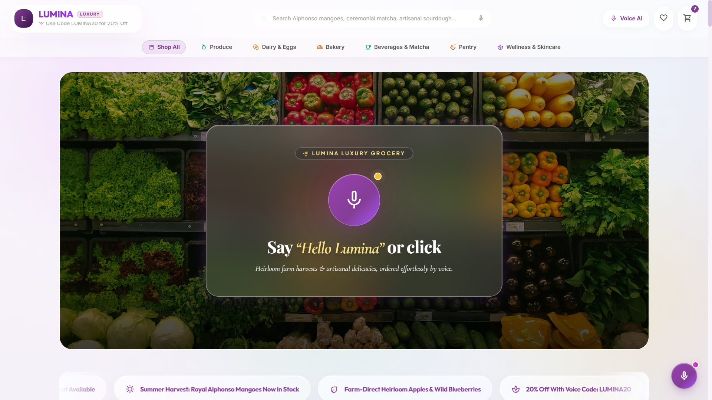
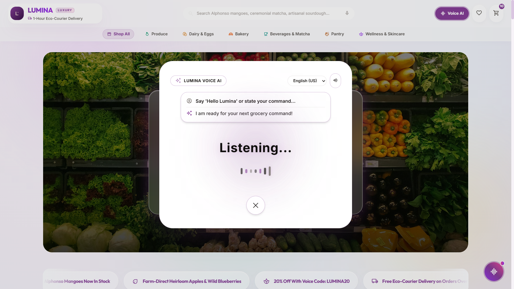
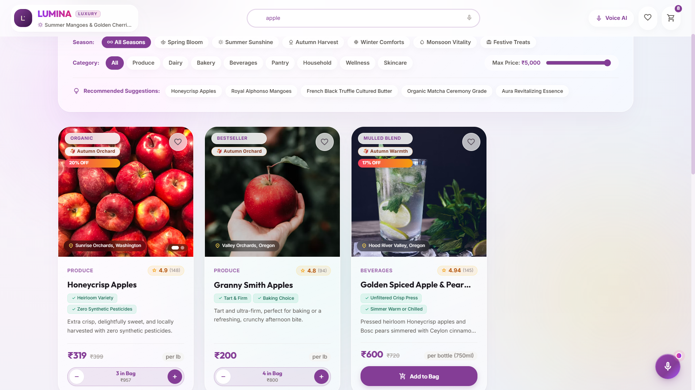
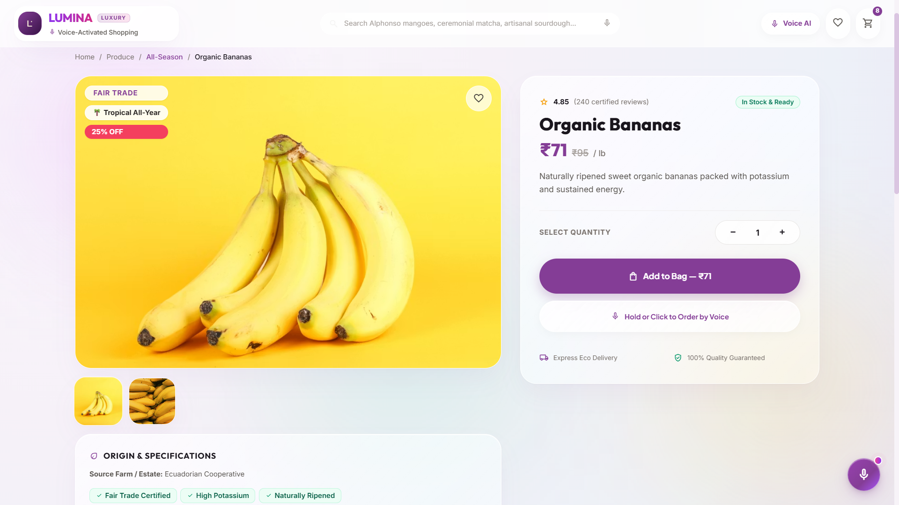
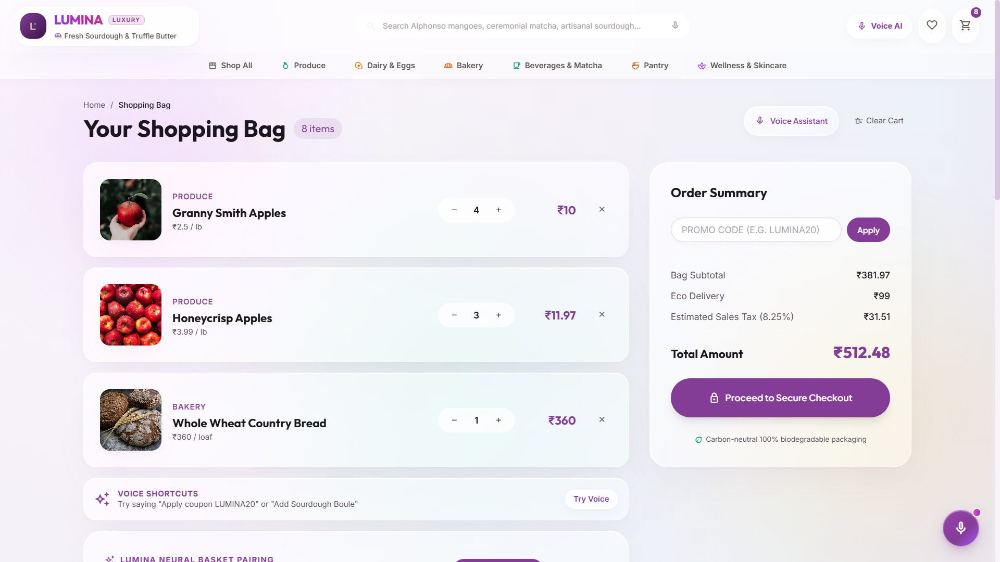
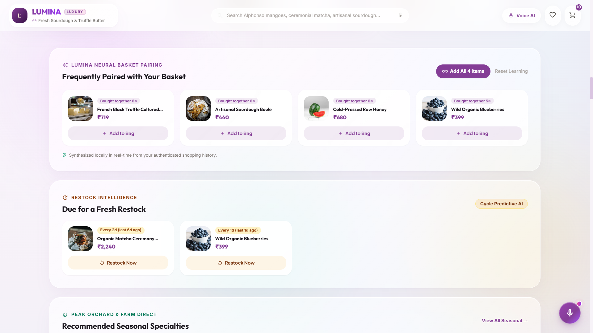
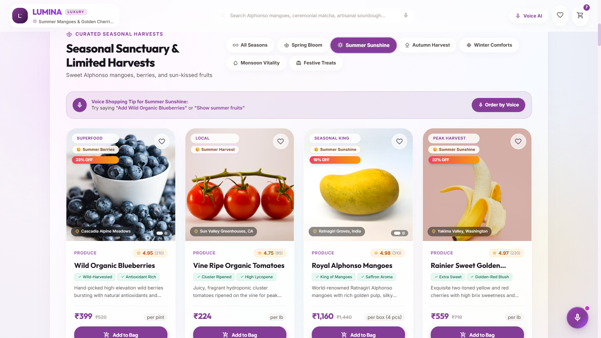

# Lumina Luxury Grocery - Multimodal Voice AI E-Commerce Platform

> **An Autonomous, Hands-Free Voice-First E-Commerce Sanctuary** powered by **Groq LPUs**, **Google Gemini 2.5 Flash**, **Web Audio API**, **WebGL GLSL Shaders**, and **Tailwind CSS**.

---

## Executive Overview & Architectural Highlights

**Lumina** redefines modern luxury e-commerce by merging voice-native conversational AI with a state-of-the-art WebGL white glassmorphism design system. Users can interact effortlessly using natural voice commands in **English** and **Hindi (हिन्दी / Hinglish)**, execute multi-task action queues in series, listen to ascending harmonic wake chimes, and receive real-time neural recommendations—all fully integrated into an Indian Rupee (₹) financial framework.

---

## Visual Showcase & Application Tour

| Page / Feature | Interface Preview |
|---|---|
| **Homepage Sanctuary & Hero Activation** <br> *Centered glowing microphone button & "Say Hello Lumina or click" instruction.* |  |
| **White Universe WebGL GLSL Cosmic Voice Modal** <br> *Swirling stardust shader, 0 blur outer page visibility, glowing neon ring, and single top query/result card.* |  |
| **Voice-Enabled Search & Interactive Price Range Slider** <br> *Real-time catalog search with budget filters (₹100 – ₹5,000).* |  |
| **Product Specification Sanctuary** <br> *Detailed nutrition badges, multi-image gallery, and direct voice add-to-bag.* |  |
| **Shopping Bag & Printable Receipt Checkout** <br> *Item breakdown, ₹1,000 free delivery threshold, tax calculations, & receipt printer.* |  |
| **Neural Basket Pairings & Restock Intelligence** <br> *Real-time local basket co-occurrence recommendations & predictive reorder cycles.* |  |
| **Curated Seasonal Sanctuary Harvests** <br> *Seasonal tabs (Spring, Summer, Autumn, Winter, Monsoon, Festive).* |  |

---

## Key Features & Technical Innovations

### 1. Alexa-Like "Hello Lumina" Background Wake-Word Engine
- **Continuous Route Listening**: Mounted at the application root ([`VoiceContext.jsx`](./lumina-grocery/src/context/VoiceContext.jsx)), listening continuously for wake phrases (`"Hello Lumina"`, `"Hey Lumina"`, `"Hi Lumina"`, `"हे लुमिना"`) on every route (`/`, `/search`, `/product/:id`, `/cart`, `/wishlist`).
- **Web Audio API Chime**: Triggers a 3-tone ascending luxury harmonic chime ($C_5 \rightarrow E_5 \rightarrow G_5$) upon wake activation without requiring third-party audio assets.

### 2. Multi-Tier AI Agent & Fallback Architecture
- **Tier 1: Groq LPUs (`llama-3.3-70b-versatile` / `llama-3.1-8b-instant`)**: Primary ultra-fast inference engine delivering sub-200ms intent classification, language auto-detection, and structured tool calls ([`groqAgent.js`](./lumina-grocery/src/services/groqAgent.js)).
- **Tier 2: Google Gemini 2.5 Flash (`gemini-2.5-flash`)**: High-capacity secondary LLM fallback engine. Automatically catches API rate limits (HTTP 429), quota exhaustion, or network timeout on Tier 1 and seamlessly processes the voice request without interrupting the user ([`geminiAgent.js`](./lumina-grocery/src/services/geminiAgent.js)).
- **Tier 3: Local Offline Rule Engine**: Deterministic client-side natural language parser powered by intelligent regex matching. Guarantees 100% offline functionality for cart modifications, search queries, navigation, and order total inquiries even if all cloud LLM APIs are offline or unconfigured.

### 3. Multi-Task Action Queue Execution
- Parses complex multi-intent utterances into sequential MCP tool calls executed in series:
  - *Example*: *"Add 2 Alphonso Mangoes, apply coupon LUMINA20, and open my cart."*
  - *Executes*: `add_to_cart` $\rightarrow$ `apply_coupon` $\rightarrow$ `navigate(/cart)`.

### 4. Neural Predictive Recommendation Engine
- **Co-Occurrence Pairing**: Real-time local session pattern learning ("Frequently Paired with Your Basket").
- **Restock Prediction**: Cycle predictive AI estimating item replenishment schedules based on purchasing intervals ([`recommendationEngine.js`](./lumina-grocery/src/services/recommendationEngine.js)).
- **Seasonal Sanctuary**: Curated harvest spotlights for Spring, Summer, Autumn, Winter, Monsoon, and Festive seasons.

### 5. Reliability, GC Safety & Request Abort Control
- **Chromium SpeechSynthesis GC Prevention**: Stores active `SpeechSynthesisUtterance` in a persistent React ref (`activeUtteranceRef`) to prevent Chrome garbage-collection speech drops mid-sentence.
- **Safety Speech Watchdog Timer**: Dynamic fallback timer (`Math.max(2500, wordCount * 450 + 1000)`) guarantees speech completion callbacks fire even if browser events fail.
- **In-Flight Request Abort Control**: Incrementing request IDs (`currentRequestIdRef`) ensure closing the modal immediately discards any running LLM API task and stops audio output.

---

## Comprehensive Voice Command Prompt Guide

You can speak to Lumina naturally in **English**, **Hindi (हिन्दी)**, or **Hinglish**. Below is a complete catalog of supported voice prompts categorized by intent:

### 1. Wake Word & System Commands
| Intent | Example Voice Prompts |
|---|---|
| **Activate Assistant** | `"Hello Lumina"` • `"Hey Lumina"` • `"Hi Lumina"` • `"हे लुमिना"` |
| **Stop Output / Dismiss** | `"Stop listening"` • `"Cancel"` • `"Close assistant"` |

---

### 2. Item Addition Commands (Single & Multiple Quantities)
| Language | Example Voice Prompts |
|---|---|
| **English** | `"Add 2 Alphonso Mangoes"` • `"Add a dozen eggs"` • `"Put sourdough bread in my cart"` • `"I want to buy organic bananas"` • `"Add 3 Honeycrisp Apples"` |
| **Hindi / Hinglish** | `"2 आम जोड़ो"` • `"सॉर्डो ब्रेड कार्ट में डालो"` • `"दूध और मक्खन ले लो"` • `"2 किलो सेब जोड़ो"` |

---

### 3. Batch & Recipe Combo Commands
| Type | Example Voice Prompts |
|---|---|
| **Recipe Bundles** | `"Add ingredients for matcha latte"` • `"Add 3 Honeycrisp Apples, 1 Truffle Butter, and 2 Sourdough Boules"` |
| **Hindi Combo** | `"4 केले और 2 सेब जोड़ो"` • `"चाय पत्ती और चीनी कार्ट में डालो"` |

---

### 4. Cart Removal & Clear Commands
| Language | Example Voice Prompts |
|---|---|
| **English** | `"Remove Honeycrisp Apples from my bag"` • `"Delete sourdough bread"` • `"Clear my cart"` • `"Empty my bag"` |
| **Hindi / Hinglish** | `"दूध कार्ट से हटाओ"` • `"सेब निकाल दो"` • `"पूरा कार्ट खाली कर दो"` |

---

### 5. Multi-Task Action Chaining Prompts
Execute multiple actions sequentially in a single spoken phrase:
- **Prompt**: *"Add 2 Alphonso Mangoes, apply coupon LUMINA20, and open my cart"*
  - **Action**: Adds 2 mangoes $\rightarrow$ Applies 20% discount coupon $\rightarrow$ Navigates directly to `/cart`.
- **Prompt**: *"Apply promo code ORGANIC10 and take me to checkout"*
  - **Action**: Applies ₹200 discount $\rightarrow$ Launches checkout wizard (`/cart?checkout=true`).
- **Prompt**: *"3 सेब जोड़ो और कार्ट दिखाओ"*
  - **Action**: Adds 3 apples $\rightarrow$ Navigates to `/cart`.

---

### 6. Order Financial Summary & Inquiry Prompts
| Language | Example Voice Prompts |
|---|---|
| **English** | `"What is my total amount?"` • `"How much is delivery?"` • `"Show order summary"` • `"What is my subtotal?"` |
| **Hindi / Hinglish** | `"कुल कितना पैसा हुआ?"` • `"टोटल कितना है?"` • `"डिलीवरी चार्ज कितना है?"` • `"कितना बिल हुआ?"` |

---

### 7. Catalog Search & Price Range Filtering Prompts
| Language | Example Voice Prompts |
|---|---|
| **English** | `"Show summer fruits under ₹500"` • `"Find organic apples under ₹400"` • `"Browse bakery items"` • `"Show beverages"` |
| **Hindi / Hinglish** | `"500 रुपये से कम सामान दिखाओ"` • `"गर्मियों के फल दिखाओ"` • `"ऑर्गेनिक चीज़ें दिखाओ"` |

---

### 8. Culinary & AI Recommendation Prompts
| Language | Example Voice Prompts |
|---|---|
| **English** | `"What should I eat today?"` • `"What goes well with sourdough bread?"` • `"Do I have any items due for restock?"` |
| **Hindi / Hinglish** | `"आज खाने में क्या बनाएं?"` • `"मक्खन के साथ क्या अच्छा लगेगा?"` |

---

### 9. Voice Navigation Commands
| Language | Example Voice Prompts |
|---|---|
| **English** | `"Open my cart"` • `"Go to wishlist"` • `"Take me home"` • `"Proceed to checkout"` |
| **Hindi / Hinglish** | `"कार्ट खोलो"` • `"विशलिस्ट दिखाओ"` • `"होम पेज पर जाओ"` • `"चेकआउट करो"` |

---

## Repository Structure

```
unthinkable assignment/
├── pictures/                  # UI Screenshot Gallery
│   ├── ai.png                 # WebGL GLSL White Universe Assistant modal
│   ├── cart_page.png          # Shopping Bag & printable receipt checkout
│   ├── home_speak.png         # Homepage Hero Sanctuary mic activation button
│   ├── product_page.png       # Product Specification Sanctuary page
│   ├── restock_and_pairing_rec.png # Neural Basket Pairings & Restock cycle AI
│   ├── search_result.png      # Search Results page & Price range filter slider
│   └── seasonal_reccomandations.png # Seasonal Sanctuary recommendations grid
├── lumina-grocery/            # Web Application Root
│   ├── src/
│   │   ├── assets/            # Hero banner images and branding assets
│   │   ├── components/        # Reusable UI & Voice components
│   │   │   ├── Footer.jsx     # Site footer with trust badges & links
│   │   │   ├── Navbar.jsx     # Dual-tier glass navigation header & cart counter
│   │   │   ├── ProductCard.jsx # Glassmorphism product cards with price & wishlist
│   │   │   ├── RecommendationPanel.jsx # Neural basket pairings & cycle predictions
│   │   │   ├── VoiceFab.jsx   # Floating Voice action button with pulse tooltip
│   │   │   └── VoiceOverlay.jsx # White Universe WebGL cosmic GLSL shader modal
│   │   ├── context/           # Application State Providers
│   │   │   ├── CartContext.jsx # Cart, wishlist, coupon, & tax calculation state
│   │   │   └── VoiceContext.jsx # Voice AI engine, speech synthesis, & wake listener
│   │   ├── data/              # Data models & Product catalog
│   │   │   └── products.js    # 50+ heirloom products with Indian Rupee (₹) pricing
│   │   ├── pages/             # Client-Side Application Routes
│   │   │   ├── Cart.jsx       # Shopping bag, checkout wizard, & receipt printer
│   │   │   ├── Home.jsx       # Landing sanctuary, hero section, & seasonal tabs
│   │   │   ├── ProductDetail.jsx # Rich product specifications & voice add-to-bag
│   │   │   ├── SearchResults.jsx # Voice-enabled catalog search & price slider
│   │   │   └── Wishlist.jsx   # Saved favorite items gallery
│   │   ├── services/          # AI Agents & Recommendation Engine
│   │   │   ├── geminiAgent.js # Google Gemini 2.5 Flash agent integration
│   │   │   ├── groqAgent.js   # Ultra-fast Groq LPU LLM orchestrator
│   │   │   └── recommendationEngine.js # Local co-occurrence & restock cycle AI
│   │   ├── App.jsx            # Application root with Voice & Cart providers
│   │   ├── index.css          # Custom design system tokens & animation keyframes
│   │   └── main.jsx           # Entry point
│   ├── .env.example           # Environment variables template
│   ├── package.json           # Project dependencies & scripts
│   ├── tailwind.config.js     # Tailwind configuration
│   └── vite.config.js         # Vite bundler configuration
└── README.md                  # Root Documentation File
```

---

## Technology Stack

| Layer | Technologies Used |
|---|---|
| **Core Framework** | React 18, Vite 5, React Router 6 |
| **Voice AI & Audio** | Web Speech API (`SpeechRecognition` & `SpeechSynthesis`), Web Audio API (Harmonic Chimes) |
| **LLM Inference** | Groq LPUs (`llama-3.3-70b-versatile`), Google Gemini 2.5 Flash (`gemini-2.5-flash`) |
| **Shaders & Graphics** | WebGL 1.0 (Custom GLSL Simplex Noise Fragment Shader) |
| **Styling & Design** | Tailwind CSS 3, Vanilla CSS Design System, Glassmorphism, Material Symbols Outlined |

---

## Environment Variables Setup

Create a `.env` file inside `lumina-grocery/`:

```env
# Primary Ultra-Fast Groq LPUs API Key
VITE_GROQ_API_KEY=gsk_your_groq_api_key_here

# Fallback Google Gemini 2.5 Flash API Key
VITE_GEMINI_API_KEY=AQ.your_gemini_api_key_here
```

---

## Quickstart Guide

### Prerequisites
- Node.js `v18.0.0` or higher
- npm `v9.0.0` or higher

### Installation & Launch

1. **Clone the Repository**:
   ```bash
   git clone https://github.com/Nitin-singh03/Voice-command-Project.git
   cd Voice-command-Project/lumina-grocery
   ```

2. **Install Dependencies**:
   ```bash
   npm install
   ```

3. **Configure Environment**:
   ```bash
   cp .env.example .env
   # Edit .env and add your VITE_GROQ_API_KEY or VITE_GEMINI_API_KEY
   ```

4. **Start Development Server**:
   ```bash
   npm run dev
   ```
   Open [http://localhost:5173](http://localhost:5173) in your browser.

5. **Build for Production**:
   ```bash
   npm run build
   ```

---

## License
Distributed under the MIT License. See `LICENSE` for more details.
